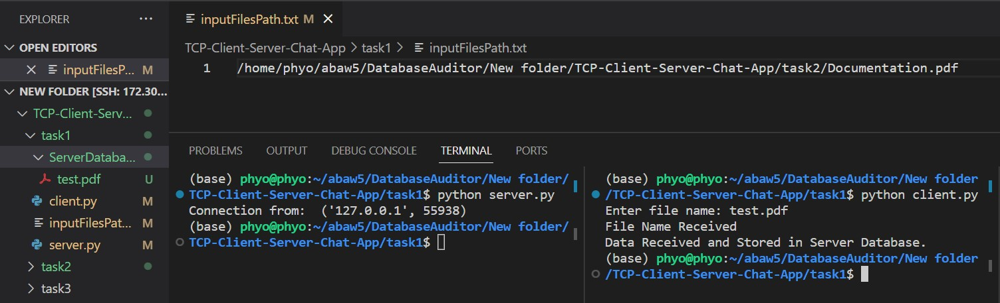
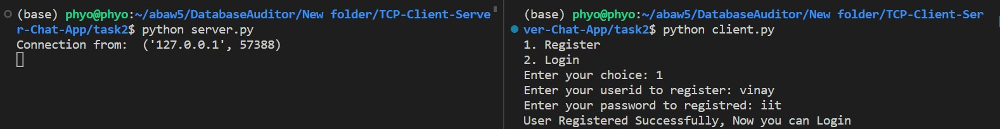
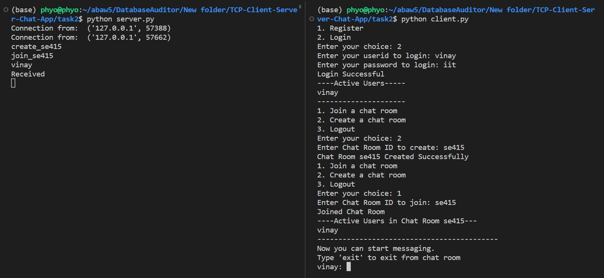
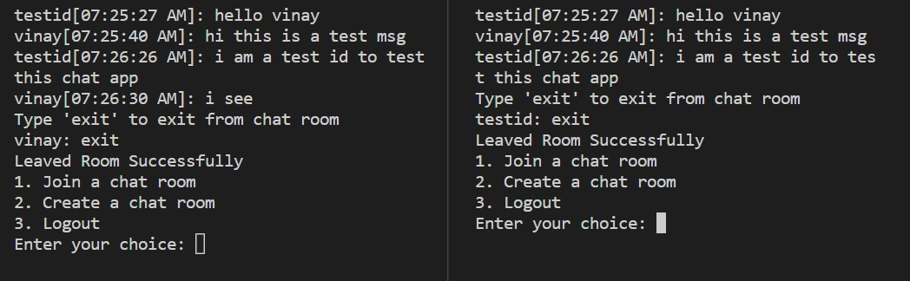
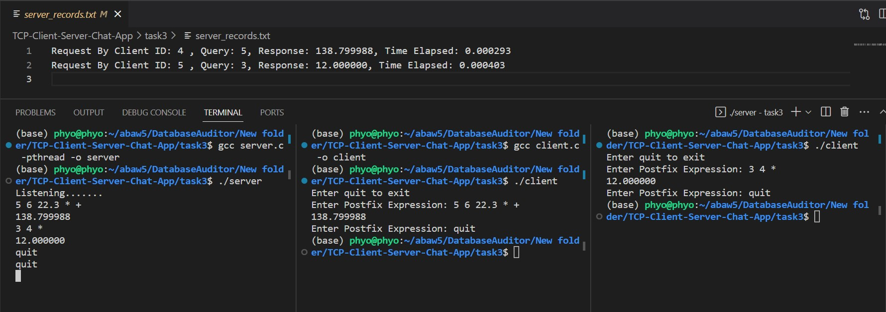

# Computer Network Assignment 4
<h3> Vinay Kumar 2020CSB1141 </h3>
<u><h2> Task 1 </h2></u>

#### 1.1 Write the path of the file in <i>inputFilesPath.txt</i>
#### 1.2 Write the path without double quotes i.e write as <i>path</i> not as <i>"path"</i>
#### 1.3 To compile the code run the following command in terminal
```bash
python server.py
python client.py
```
#### 1.4 You will be asked to enter the file name in the client terminal and the file will be sent to the server
#### 1.5 The server will save the file in the <i>ServerDatabase</i> folder with the same name provided by the client



<u><h2> Task 2 </h2></u>

#### 1.1 To compile the code run the following command in terminal
```bash
python server.py
python client.py
```
#### 1.2 You can open multiple terminals and run multiple clients. The server will handle all the clients simultaneously.
#### 1.3 More information is given in <i>Doucmentation.pdf</i> file.




<u><h2> Task 3 </h2></u>

#### 1.1 To compile the code run the following command in terminal
```bash
gcc server.c -pthread -o server
gcc client.c -o client
```
#### 1.2 Run the server first
```bash
./server
```
#### 1.3 Open another terminal and Run the client
```bash
./client
```
#### 1.4 You can open multiple terminals and run multiple clients
#### 1.5 You will be asked to enter the expression in the client terminal
#### 1.6 Enter <i>quit</i> to exit the client
#### 1.7 The server will receive the experssion, evaluate and send the result back to the client and will write it in <i>server_records.txt</i> file
#### 1.8 The expression should be written in the space separated format as provided in the question. For example: <i> 2 3 + </i>

